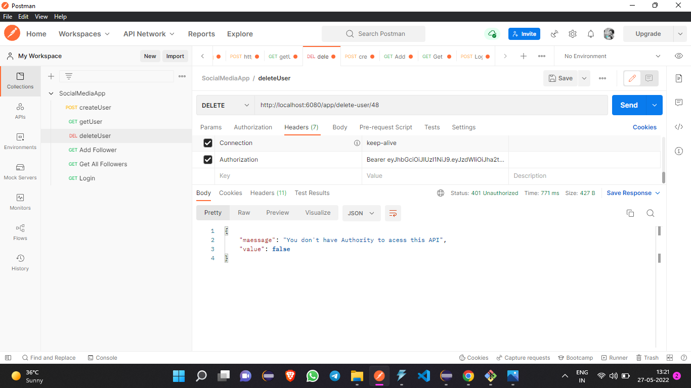

# social-media-app-backend
Hey there, this is Akki here to explain my assignment which is Social Media App.This is pure backend project made in Java.I will mention the used technologies below.
1) **Spring Boot Framework**
2) **Hibernate Framework**
3) **MySQL Database**
4) **Spring Security**
5) **JWT based authorization**
6) **BCrpyt Password Encoder**

## Below is the explaination of the Endpoints

1) ## "app/signup" => To create new Account in our database.  
      This will open for all user, means no athentication or authorization requirde to access this API. If the user enter valid data then this data will 
      be saved in the database.We use Bcrypt password encoder to save passowrd into database so that no one not even server owner can see your password.
      
       If user try to enter some inavlid inputs or blank inputs then proper message will be shown
       .png)
       
2) ## "app/login" => To login user.  
      This API will goes JWT service to generate token by authenticating username and password with the help of UsernamePasswordAuthenticationToken class which
      is of Spring Security.If username and password matches to our database record then authentication will be successful and token will be generated and returned.After user authenticated successfully, 
       every API call instead of username and password, this token will used to acess our APIs.On every API call token will be checked and verify if its valid or not, if valid then user can acess our API.
      As we are not using any frontend technology here, so when you login and genrate token then copy it and paste into header section of Postman as key Authorization and value
      as token.
      
      ## If user enter some inavlid fields then proper message will be displayed.
      
       
      
3) ## "app/delete-user/{id}" => To Delete user by providing user id from Admin Role or Authority.  
      This API is only for Admin Role.If in future, we create admin role dashboard by adding some logic into code then only Admin can access this API and remove user from database.
      As we kept Role,Follwers,Following and UserImages cascade type to All,that means by removing user, all corresponding data of these entity related to user also get deleted.
      
      

4) ## "app/get-user/{id}" => To fetch user details by providing user id.    
    This will return all user details if we give proper user id in url.
    
    
5) ## "user/add-follower/{userId}" => To add details of follower to the database respect to current user.  
    This will add follower details into database respect to user whose user id we will be provide in URL path.A follower will have a firstName,lastName and imageName.
    

6) ## "user/get-all-followers/{id}" => To get all User's Followers  
    Retrive the list of all user's follower.We need to add user id into the URL path.
    
    
7) ## "user/add-following/{userId}" => To add details of that user to whom our user follow.  
      This will add user details of the user to whom our logged in user follow.This will also have firstName,lastName and imageName.
      
      
8) ## "user/get-all-following/{id}" => To get all User's Following.  
    Retrive the list of all user's following.We need to add user id into the URL path.
    
    
9) ## "user/image/upload/{userId}" => To post image into user's own account.
      This will add image in database with user id which we are giving in URL.We created seperate table for saving images details like name,size etc.
      
      
10) ## "user/image/get/{userId}" => To retrive image related to provided user id.
      This will return an image saved in database related to provided user id.
       
      
      
***As a fresher , I gave my 100% and if u were expecting more then sorry I couldn't. No doubt this isn't perfect code for this app,
an Experienced player can do this is in less lines of code and with less efforts but that's why he is experienced and I am fresher***
      
